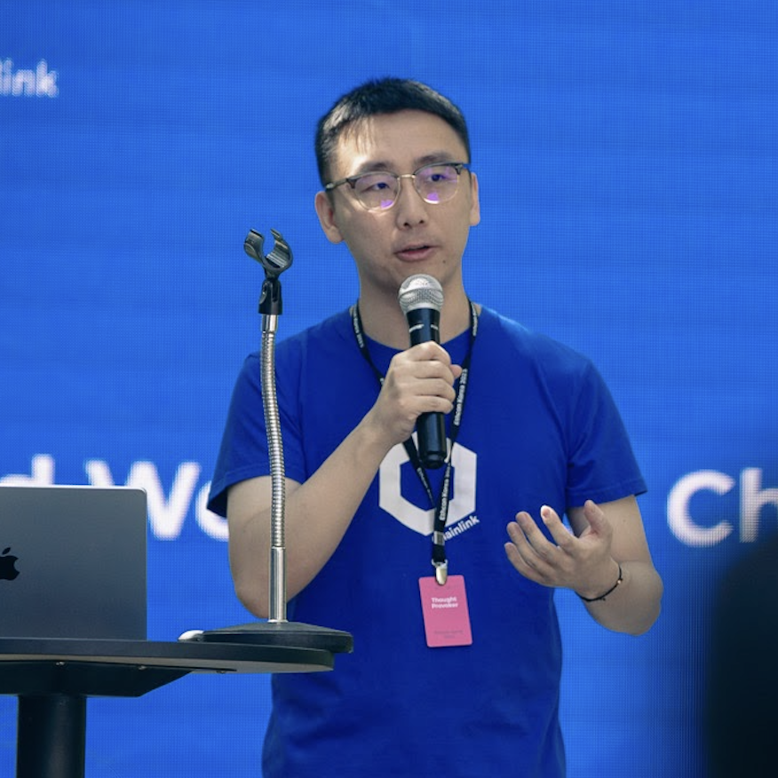

# 欢迎参加 CRE Bootcamp

欢迎参加**CRE Bootcamp：构建 AI 驱动的预测市场**！

这是一个为期两天的实操训练营，旨在为你提供深入的、以开发者为中心的 Chainlink Runtime Environment (CRE) 构建指南。

## 🎤 讲师介绍

### Frank Kong
**开发者关系工程师, Chainlink Labs**

X (Twitter): [@AlongHudson](https://x.com/AlongHudson)

LinkedIn: [Frank Kong](https://www.linkedin.com/in/frank-kong-0a927785/)

## 课程安排

### 📅 Day 1：基础 + 市场创建（2 小时）

构建你的第一个 CRE workflow，在链上创建预测市场：
- CRE 思维模型与项目搭建
- 智能合约部署
- HTTP Trigger 与 EVM Write Capability
- ❓ 答疑 - 开放提问环节

### 📅 Day 2：完整结算工作流（2 小时）

将一个完整的 AI 驱动结算系统串联起来：
- 用于事件驱动工作流的 Log Trigger
- EVM Read Capability
- 与 Google Gemini 的 AI 集成
- 端到端结算流程
- ❓ 答疑 - 开放提问环节
